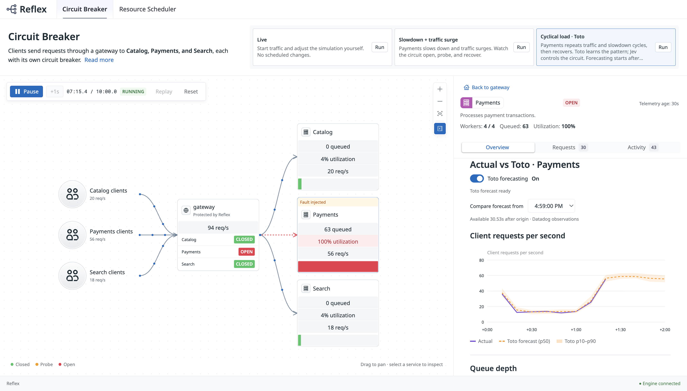

# Reflex

Reflex is a Rust library for control loops that act on observability data. Metrics queried from [**Datadog**](https://www.datadoghq.com/) and forecasts from [**Toto**](https://github.com/DataDog/toto) become typed state. A model, such as TypeSafe AI's **Jev**, recommends an action, and Reflex commits it only if it passes the guards and invariants you declared.

```text
Application supplies typed state
              ↓
Judge recommends an action
              ↓
Executor checks legality, guards, and invariants
              ↓
Verified state transition
              ↓
Optional effects perform external work
```

The repository includes a simulator that runs Reflex against simulated services. The sections below walk through its circuit breaker, starting with the state machine and then the running simulation.

## A circuit breaker

A gateway routes client traffic to three services, Catalog, Payments, and Search, each behind its own circuit. Jev decides when a circuit should open or probe. Reflex decides whether that decision may take effect.

Each recommendation is a typed action. Besides Jev's choice, it carries the Datadog evidence the decision was based on, when that evidence was observed, and the circuit revision it applies to.

```rust
struct Action {
    choice: Choice,                          // Open, Probe, or NoChange
    telemetry: Option<TelemetryEvidence>,    // Datadog observations Jev received
    observed_at: f64,
    revision: u64,
}
```

These are the machine's main rules, abridged from [`jev.rs`](crates/reflex-sim/src/jev.rs).

```rust
let definition = state_machine! {
    phase: CircuitPhase,
    data: Data,
    action: Action,
    event: Event,
    invariants: [valid_phase],
    transitions: [
        // Jev's recommendations
        CircuitPhase::Closed + action(Action { choice: Choice::Open, .. }) => CircuitPhase::Open {
            guard: can_open, update: open,
        },
        CircuitPhase::Open + action(Action { choice: Choice::Probe, .. }) => CircuitPhase::HalfOpen {
            guard: can_probe, update: probe,
        },
        CircuitPhase::Closed + action(Action { choice: Choice::NoChange, .. }) => CircuitPhase::Closed {
            guard: fresh,
        },
        // Probe results
        CircuitPhase::HalfOpen + event(Event::Response(Observation { outcome: ClientOutcome::Success, .. })) => CircuitPhase::HalfOpen {
            guard: current_probe, update: probe_succeeded,
        },
        CircuitPhase::HalfOpen + event(Event::FinalProbe(Observation { outcome: ClientOutcome::Success, .. })) => CircuitPhase::Closed {
            guard: final_probe, update: close,
        },
        CircuitPhase::HalfOpen + event(Event::Response(Observation { outcome: ClientOutcome::Error | ClientOutcome::Timeout, .. })) => CircuitPhase::Open {
            guard: current_probe, update: reopen,
        },
        // Evaluation failed (for example, an inference error): leave the circuit as it is
        CircuitPhase::Closed + evaluation_error(_) => unchanged {},
        // ... clock ticks, response recording, and the remaining no-change rules
    ],
};
```

The guards are where observability data meets fixed rules.

| Guard | Rejects a recommendation when |
| --- | --- |
| `fresh` | The circuit changed while Jev was deciding, the Datadog evidence is missing or stale, or the recommendation is past its 10-second execution deadline |
| `can_open` | The evidence does not include ten responses from a complete Datadog window collected after the circuit's last transition |
| `can_probe` | The circuit's 3-second cooldown has not elapsed |
| `current_probe` | A response does not belong to the probe currently in flight |
| `final_probe` | Fewer than five consecutive probes have succeeded |

The `valid_phase` invariant checks that the phase, cooldown, and probe reservation always agree. Guards run at execution time against current state, so a recommendation based on delayed telemetry or an inaccurate forecast cannot open, probe, or close a circuit on its own.

## Running the simulation



Seven minutes into the scenario, Jev has opened the Payments circuit during a traffic surge. The panel on the right compares a Toto forecast of Payments request rate with the Datadog observations that followed; observations stop where Datadog has not yet caught up.

**Where the state comes from.** The simulated services publish metrics to Datadog. The simulator queries them back to build each service's state, such as its error rate, latency, and queue depth.

**How it is forecast.** A local [Toto](https://github.com/DataDog/toto) service receives the observed history of request rate, queue depth, and utilization, and forecasts the next 120 seconds as p10/p50/p90 values in ten-second buckets. It needs 320 seconds of history before the first forecast. Select a service to compare the frozen forecast with what was later observed.

**What happens to a decision.** Every 10 seconds, Jev evaluates each service and returns Open, Probe, or NoChange. Reflex applies the recommendation only if the matching transition's guard passes. Open **Activity** and inspect a decision to see the Datadog values and timestamps Jev received, any forecast, and whether the transition was applied or rejected, with the rejection reason.

**The scenario shown.** In **Cyclical load · Toto**, Payments repeats a two-minute pattern for ten minutes. Traffic rises 4× at +30s, service time rises 6× at +60s, and both recover at +90s. Jev chooses when to open and probe. Reflex enforces the cooldown and the five-probe close.

Reflex also emits its own OpenTelemetry counters and spans (`reflex.evaluations`, `reflex.transitions`). The simulator exports these to Datadog with the application metrics, and the supplied [dashboards](dashboards/README.md) show both. The simulator also includes a **resource scheduler** that follows the same pattern; see the [simulator guide](crates/reflex-sim/README.md).

## Run the simulator

| Requirement | Used for |
| --- | --- |
| Rust 1.92+ and Node.js | The simulator and its UI |
| `DD_API_KEY`, `DD_APP_KEY`, `DD_SITE` | Publishing and querying metrics. The application key needs `timeseries_query` permission. |
| `TYPESAFE_API_KEY` | Live Jev recommendations |
| [uv](https://docs.astral.sh/uv/) | The local Toto service. Toto needs no API key. |

Build the UI once.

```sh
npm ci --prefix crates/reflex-sim/ui
npm run build --prefix crates/reflex-sim/ui
```

In one terminal, start the Toto service.

```sh
uv sync --project integrations/toto --python 3.12 --locked
uv run --project integrations/toto --locked reflex-toto
```

Wait for `Ready: http://127.0.0.1:8765`. The first start downloads a pinned **Toto-2.0-22m** checkpoint, which runs on CPU by default.

In a second terminal, copy [`.env.example`](.env.example) to `.env.local`, fill in your keys, and start the simulator.

```sh
set -a
. ./.env.local
set +a
cargo run -p reflex-sim --features datadog --locked -- \
  --playground --policy jev --datadog --datadog-evidence \
  --toto-url http://127.0.0.1:8765
```

Select **Cyclical load · Toto → Run**, then select **Payments**. Use the decision's `simulation_run` to filter the [Datadog dashboards](dashboards/README.md). Press **Ctrl+C** to stop and flush telemetry.

There are other ways to run it.

- To run **without Datadog**, drop `--features datadog`, `--datadog`, and `--datadog-evidence`. State and forecasts then come from the simulator's local observations, and only `TYPESAFE_API_KEY` is required.
- To **publish to Datadog but decide on local state**, use `--datadog` without `--datadog-evidence`. Publishing needs only `DD_API_KEY`.
- To run **without credentials**, use `cargo run -p reflex --example circuit_breaker`, a smaller circuit breaker with a deterministic judge.

## Use Reflex in your application

Your application gathers the evidence, whether that is a Datadog query, a forecast, or local measurements, and builds the typed state passed to the judge.

| Concept | What it does |
| --- | --- |
| **State** | A Rust value your application prepares for evaluation, such as local observations, queried metrics, or forecasts. |
| **Judge** | Implements `Judge<S, A>` and returns a typed action with optional confidence. It can call Jev or use an ordinary algorithm. |
| **Controller** | Calls the judge with an inference deadline and returns a proposed decision or an evaluation error. It does not change system state. |
| **State machine** | Declares phases and transitions. Guards check whether an action is allowed; invariants check properties every committed state must satisfy. |
| **Executor** | Checks current state, prepares a candidate, validates it, and commits it. Declared asynchronous effects run after commit and return events to the machine. |

Your application calls the controller, then the executor.

```rust
// Gather evidence (for example, Datadog observations and a Toto forecast) into `state`.
let evaluation = controller.evaluate(&state).await;
let outcome = executor.execute(evaluation).await?;
```

Pass the entire evaluation result to the executor; the machine can define transitions for inference failures as well as recommendations. State transitions commit in memory, and external effects run afterward. See [execution semantics](SDK_README.md#guarantees-and-current-scope) for persistence and failure handling.

For a smaller, self-contained machine that runs without credentials, see the [circuit-breaker example](crates/reflex/examples/circuit_breaker.rs) and the [SDK guide](SDK_README.md).

The crates are **not yet published to crates.io**. Add path dependencies on your checkout.

```toml
[dependencies]
reflex = { path = "../reflex/crates/reflex" }
tokio = { version = "1", features = ["rt-multi-thread", "macros"] }
```

To use Jev, also add the `typesafe-ai` and `reflex-typesafe` crates and inject a `TypeSafeClient` into `TypeSafeJudge`. The [live Jev example](crates/reflex-typesafe/examples/jev.rs) shows the setup (`cargo run -p reflex-typesafe --example jev`, with `TYPESAFE_API_KEY` set). See the [SDK guide](SDK_README.md) for hook signatures, executor construction, and the [TypeSafe integration](SDK_README.md#typesafe-integration).

## Further reading

**Datadog and Toto**

- [Datadog control loop, covering metrics, warmup, delays, and troubleshooting](crates/reflex-sim/DATADOG.md)
- [Forecasting, covering observation series, timing, uncertainty, and example workloads](crates/reflex-sim/FORECASTING.md)
- [Local Toto service, covering the API contract, model selection, and offline use](integrations/toto/README.md)
- [Datadog dashboards](dashboards/README.md)
- [Simulator scenarios and simulation model](crates/reflex-sim/README.md)

**Reflex SDK**

- [SDK quickstart and API behavior](SDK_README.md)
- [Core concepts and circuit-breaker walkthrough](REFLEX_SDK.md)
- [Declarative state-machine design](DECLARATIVE_EXECUTOR.md)
- [Core metrics, traces, and logs](crates/reflex/TELEMETRY.md)
- [Standalone TypeSafe client instrumentation](crates/typesafe-ai/TELEMETRY.md)
- [Capacity research on workloads, algorithms, and methods](studies/capacity/README.md)

Run the workspace tests with these commands.

```sh
npm ci --prefix crates/reflex-sim/ui
npm run build --prefix crates/reflex-sim/ui
cargo test --workspace --all-targets --locked
cargo test --workspace --doc --locked
```

## License

Reflex is licensed under [Apache-2.0](LICENSE). See [NOTICE](NOTICE) for attribution. Third-party dependencies and assets retain their own licenses.

Third-party components are listed in [LICENSE-3rdparty.csv](LICENSE-3rdparty.csv). See the [inventory notes](third_party/README.md) for coverage, sources, and unresolved entries.

## Ownership

Owned by Datadog, Inc. See [maintenance responsibilities](MAINTAINERS.md).
